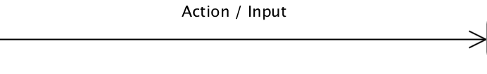

# State Machines
Agenda d. 9-10-2018 dat18b

> At anskue software som værende en maskine der på et givent tidspunkt er i én tilstand, og over tid kan ændre tilstand hører under det at designe og kode efter det pricip der kaldes for en tilstands maskine, eller en _State Machine_.

> I dag skal i lære at lave state machine diagrammer og lave deciderede state machines i jeres kode.

## Eksempler
### State Machine Diagram
Et State Machine Diagram består af følgende figurer:

> **Initial State**
    

> **State**
    

> **Action**    
    


### En Ovn er en State Machine
Og kan modeleres på følgende måde


### State Machine eksempel (mønstergenkendelse)
Problemet der skal løses er at jeg gerne vil have en maskine der kan give adgang til noget login beskyttet materiale. Men i stedet for at hver bruger har et unikt brugernavn og password kan brugeren skrive hvad som helst bare at passwordet afsluttes med et **_@_** tegn efterfulgt af en tilfældig række af **_tal_** og sluttende med et **_#_** tegn. 

Altså for eksempel: 

* Henning@123#
* Hjeningh@123#
* 1234claus@4382984637#
* @1#

På en eller anden måde skal vi lave en form for mønstergenkendelse, og _State Machine_ er en virkelig god måde at gøre det på.

#### Diagram


#### Kode

````   
  // Class with tools to be used
  
  public class Util {

    private String s;
    private String digits = "0123456789";

    public Util(String s){
        this.s = s;
    }

    public boolean checkDigits(int i){
        return digits.indexOf(s.charAt(i)) != -1;
    }
    
    public boolean checkChar(int i, char c){
        return s.charAt(i) == c;
    }

}

// Main machine class

import java.util.Scanner;

public class FSTMPatternExample {

    public static void main(String[] args) {

        Scanner scan = new Scanner(System.in);
        System.out.print("Please log in: ");
        String s = scan.nextLine();
        Util util = new Util(s);
        int state = 0;

        for (int i = 0; i < s.length(); i++) {
            if (state == 0) {
                if (util.checkChar(i, '@')) {
                    state = 1;
                }
            } else if (state == 1) {
                if (util.checkDigits(i)) {
                    // if it is a digit we are in state 2
                    state = 2;
                } else if (util.checkChar(i, '@')) {
                    state = 1;
                } else {
                    state = 0;
                }

            } else if (state == 2) {

                if (util.checkChar(i, '#')) {
                    state = 3;
                } else if (util.checkDigits(i)) {
                    state = 2;
                } else if (util.checkChar(i, '@')) {
                    state = 1;
                } else {
                    state = 0;
                }

            } else if (state == 3) {

                if (util.checkChar(i, '@')) {
                    state = 1;
                } else {
                    state = 0;
                }
            }

        }

        if(state == 3){
            System.out.println("You are in");
        } else {
            System.out.println("You could not log in");
        }
    }
}

````   


## Literatur
* Larman kap. 29.
* https://se.mathworks.com/videos/understanding-state-machines-what-are-they-1-of-4-90488.html
* https://se.mathworks.com/videos/understanding-state-machines-why-use-them-2-of-4-90489.html
* https://se.mathworks.com/videos/understanding-state-machines-mealy-and-moore-machines-3-of-4-90490.html


## Øvelser

<table>
  <tr>
    <td>* Lav et trafiklys som State Machine, med diagram og tilhørende kode som reagerer på input fra _én_ knap.
  * Koden skal laves vha Spring Boot Initializer. Og trafiklys og knap skal vises i browseren vha html og css.</td>
    <td></td>
  </tr>
</table>


<!-- Kom på et ikke alt for kompliceret eksempel, lave et stae machine diagram og omsæt det til kode og vis det for os andre sidst på dagen. -->
